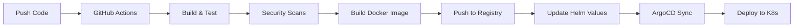

# 🚀 Fintrax Deployment Guide

## Prerequisites
- AWS CLI configured
- kubectl installed
- Helm 3+ installed
- GitHub repository with Actions enabled

## 1. 🔐 Setup GitHub Secrets

Add these secrets in GitHub → Settings → Secrets and variables → Actions:

```bash
# Development Environment
CLERK_PUBLISHABLE_KEY_DEV=pk_test_your_dev_key
CLERK_SECRET_KEY_DEV=sk_test_your_dev_secret

# Staging Environment  
CLERK_PUBLISHABLE_KEY_STAGING=pk_test_your_staging_key
CLERK_SECRET_KEY_STAGING=sk_test_your_staging_secret

# Production Environment
CLERK_PUBLISHABLE_KEY_PROD=pk_live_your_prod_key
CLERK_SECRET_KEY_PROD=sk_live_your_prod_secret

# AWS Credentials
AWS_ACCESS_KEY_ID=your_access_key
AWS_SECRET_ACCESS_KEY=your_secret_key
```

## 2. 🏗️ Deploy Infrastructure

```bash
# Initialize Terraform
cd infra/terraform
terraform init

# Deploy development environment
terraform apply -var-file="dev.tfvars"

# Deploy staging environment  
terraform apply -var-file="staging.tfvars"

# Deploy production environment
terraform apply -var-file="prod.tfvars"
```

## 3. 🎯 Setup ArgoCD

```bash
# Install ArgoCD on your cluster
kubectl create namespace argocd
kubectl apply -n argocd -f https://raw.githubusercontent.com/argoproj/argo-cd/stable/manifests/install.yaml

# Wait for ArgoCD to be ready
kubectl wait --for=condition=available --timeout=300s deployment/argocd-server -n argocd

# Get ArgoCD admin password
kubectl -n argocd get secret argocd-initial-admin-secret -o jsonpath="{.data.password}" | base64 -d

# Port forward to access ArgoCD UI
kubectl port-forward svc/argocd-server -n argocd 8080:443
```

## 4. 📦 Deploy Applications

Create ArgoCD applications for each environment:

```bash
# Apply ArgoCD applications
kubectl apply -f infra/argocd/dev-app.yaml
kubectl apply -f infra/argocd/staging-app.yaml
kubectl apply -f infra/argocd/prod-app.yaml
```

## 5. 🌿 Branch Strategy

| Branch | Environment | Auto-Deploy |
|--------|-------------|-------------|
| `main` | Production | ✅ Yes |
| `staging` | Staging | ✅ Yes |
| `develop` | Development | ✅ Yes |

### Workflow:
1. **Feature Development**: Create feature branch from `develop`
2. **Development**: Merge to `develop` → Auto-deploy to dev
3. **Staging**: Merge `develop` to `staging` → Auto-deploy to staging  
4. **Production**: Merge `staging` to `main` → Auto-deploy to production

## 6. 🔄 CI/CD Pipeline Flow



## 7. 📊 Access Applications

After deployment, applications will be available at:

- **Development**: `https://dev.fintrax.example.com`
- **Staging**: `https://staging.fintrax.example.com`  
- **Production**: `https://fintrax.example.com`

## 8. 🔍 Monitoring & Debugging

```bash
# Check pod status
kubectl get pods -n fintrax-dev
kubectl get pods -n fintrax-staging
kubectl get pods -n fintrax-prod

# Check ArgoCD application status
kubectl get applications -n argocd

# View application logs
kubectl logs -f deployment/frontend -n fintrax-dev
kubectl logs -f deployment/auth-service -n fintrax-dev

# Check Helm releases
helm list -n fintrax-dev
helm list -n fintrax-staging
helm list -n fintrax-prod
```

## 9. 🛠️ Troubleshooting

### Common Issues:

**1. Secrets not injected:**
- Verify GitHub secrets are set correctly
- Check CI/CD pipeline logs for secret injection steps

**2. ArgoCD sync issues:**
- Check if Git repository is accessible
- Verify Helm chart syntax: `helm template infra/charts/fintrax`

**3. Pod startup failures:**
- Check environment variables: `kubectl describe pod <pod-name> -n <namespace>`
- Verify Docker image is built and pushed correctly

**4. Database connection issues:**
- Ensure RDS instance is running and accessible
- Check security groups and VPC configuration

## 10. 🔄 Update Deployment

To update the application:

1. Push changes to the appropriate branch
2. CI/CD pipeline automatically builds and pushes new image
3. ArgoCD detects changes and syncs automatically
4. Monitor deployment: `kubectl get pods -w -n <namespace>`

## 11. 🧹 Cleanup

To tear down the infrastructure:

```bash
# Delete ArgoCD applications
kubectl delete -f infra/argocd/

# Destroy Terraform infrastructure
cd infra/terraform
terraform destroy -var-file="dev.tfvars"
terraform destroy -var-file="staging.tfvars"  
terraform destroy -var-file="prod.tfvars"
```

---

✅ **Your DevSecOps fintech application is now ready for deployment!**

The setup includes:
- 🔒 Automated secret management
- 🔄 GitOps with ArgoCD
- 🌿 Multi-environment branching
- 📊 Comprehensive monitoring
- 🛡️ Security best practices
- 🚀 Zero-downtime deployments
